Adalm-Pluto SDR

### ex1 - основы, генерация сигнала в реальном времени

### ex2 - Формирование сигналов, визуализация в Python. 
    task1.py - Сравнение скорости работы lists и NumPy

    task2.py - Создание графиков с различным стилем отображения

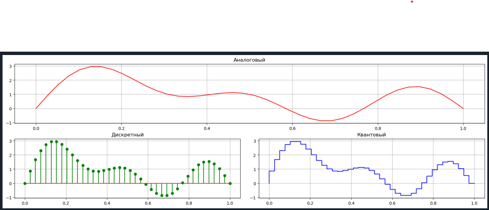

### ex3 - Изучение основных параметров библиотеки PyAdi для Adalm Pluto SDR

    Определение наисильнейшего сигнала - 2412 Мгц
    Передача данных на данной частоте
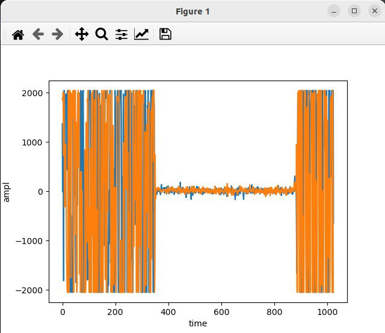
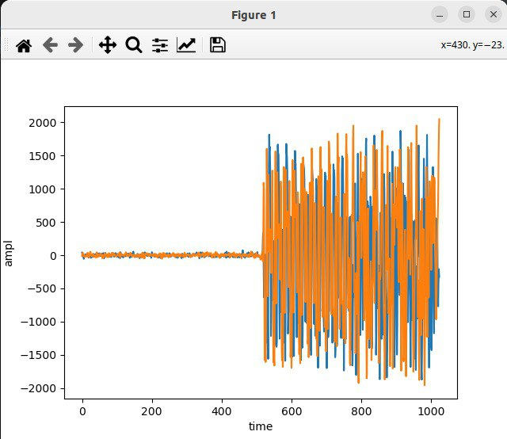

    Практика
    Практическое занятие по разделу Дискретизация сигналов

        Значение аналоговой частоты сигнала при частоте дискретизации = 1000 отсчетов/c, которая соответствует нормированной частоте Ω=0.4π рад равна 200 Гц

        Временные диаграммы 

        Частота дискретизации 500 отсчетов/с
        Количество отсчетов сигнала порядка 200 в команде arrange

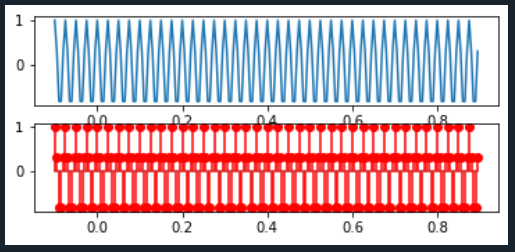

        fft

### ex4 - Изучение основных свойств ДПФ с помощью моделирования в  Python/Spyder
    ds_Fourier.py - дискретное преобразование Фурье
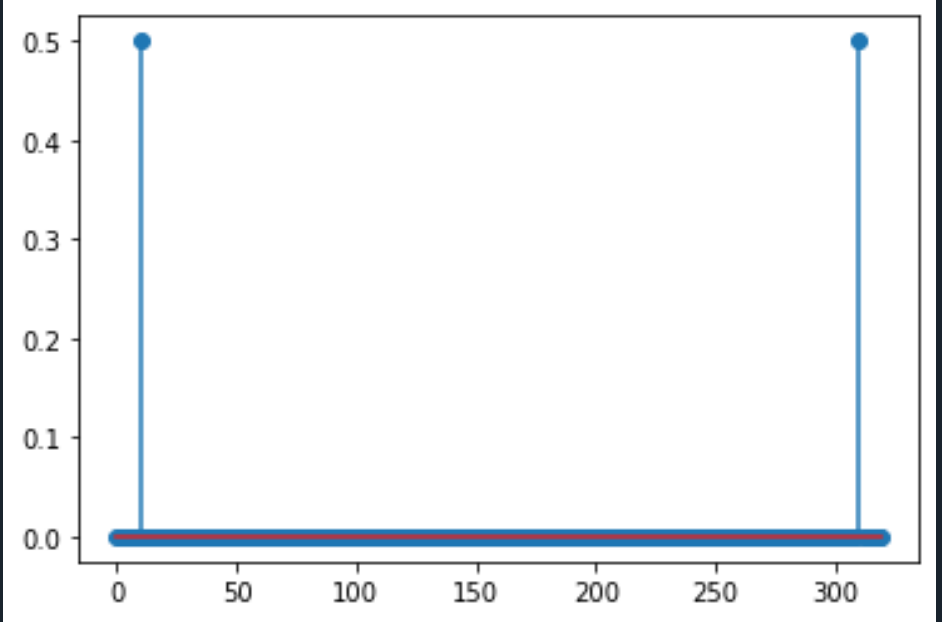
    prtask2.py - Преобразование Фурье к сигналу полученному от Adalm_Pluto_SDR

    1. Для заданных значений частоты сигнала и частоты дискретизации получите дискретное колебание, отсчеты посмотрите в Variable Explorer. Далее увеличьте частоту сигнала в несколько раз, при этом так же увеличится и частота дискретизации, но отношение частоты сигнала и частоты дискретизации - нормированная частота останется той же величиной.
    Сравните дискретные отсчеты первого и второго сигналов.
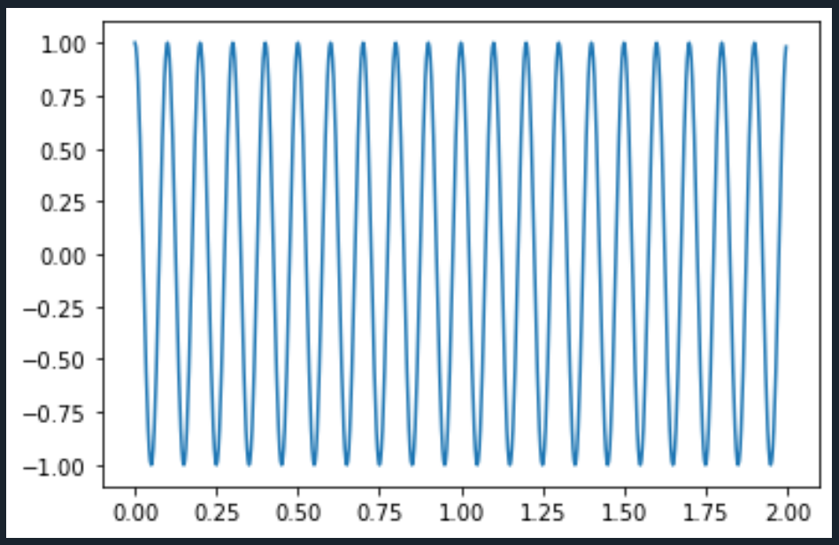

    2. Вычислите шаг частот между точками ДПФ ∆f =fs/N. Определите, в
    какой точке ДПФ находится заданный сигнал.
    fs = 320, N = 256
    ∆f = fs/N = 1.25 
    fс = 20, частота сигнала
    dpf = fc / ∆f = 16

    3. Измените частоту сигнала в целое чисто раз, определите номер точки
    ДПФ для данного сигнала.
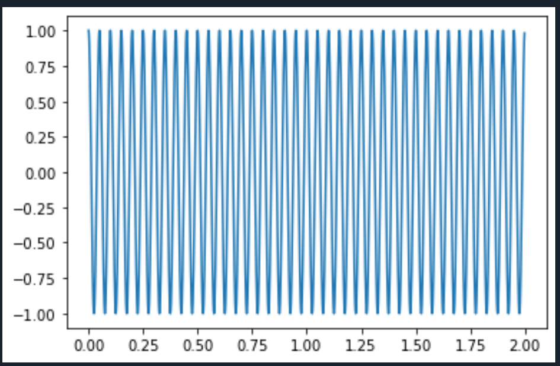

    4. Измените количество точек ДПФ до 512. Вычислите шаг частот между
    точками ДПФ ∆f = fs/N. Определите, в какой точке ДПФ находится заданный сигнал.
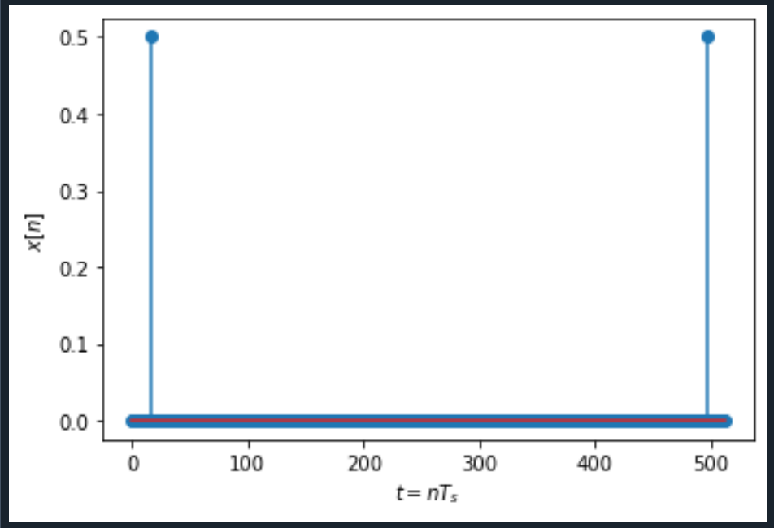
    5. Задайте сигнал в виде суммы двух колебаний. Вычислите ДПФ сигнала.
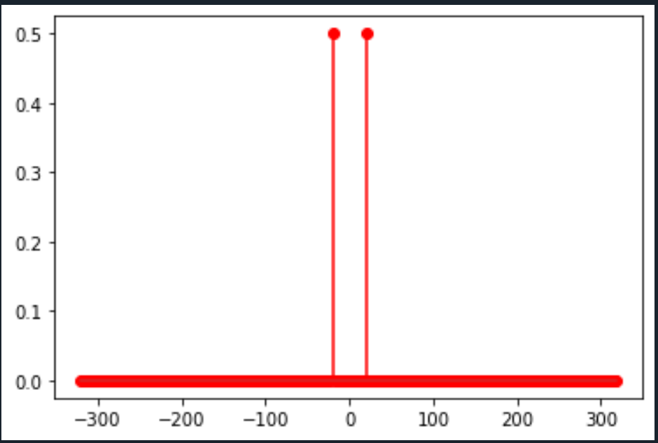
    6.  Вычислите ОДПФ сигнала, заданого в частотной области в виде X=np.array([0,0,1,0,0,0,0,0]).
    Задавайте ненулевое значение в различных разрядах. Также задайте значение в комплексной форме X=np.array([0,0,1j,0,0,0,0,0]), поменяйте знак
    мнимой единицы, задайте спектр ДПФ в виде X=np.array([0,0,2-1j,0,0,0,0,0])
    поменяйте знак мнимой единицы. Можно увеличить количество точек до
    16 при одном ненулевом значении.

    X=np.array([0,0,1,0,0,0,0,0]) - 1 график
    X=np.array([0,0,1,0,0,0,1,1]) - 2 график

    X=np.array([0,0,1j,0,0,0,0,0]) - 1 график
    X=np.array([0,0,-1j,0,0,0,0,0]) - 2 график
    
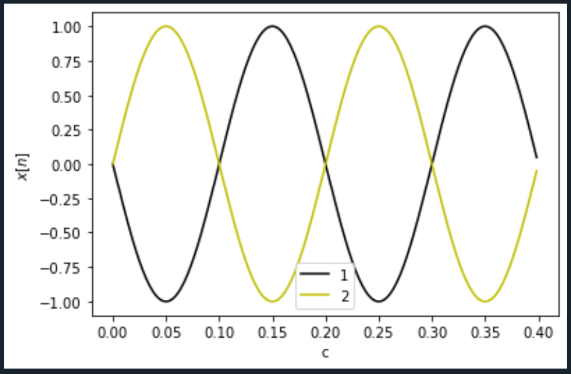

    X=np.array([0,0,2+1j,0,0,0,0,0]) - 1 график
    X=np.array([0,0,2-1j,0,0,0,0,0]) - 2 график

    X=np.array([0,0,2+1j,0,0,0,0,1,1j,0,0,2,1,1,1,0])
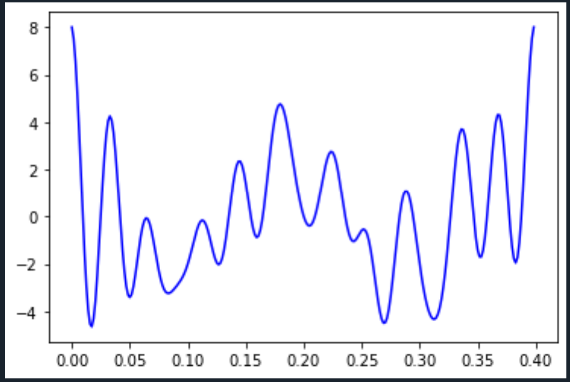
