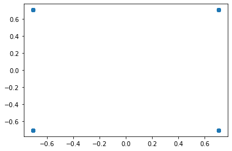
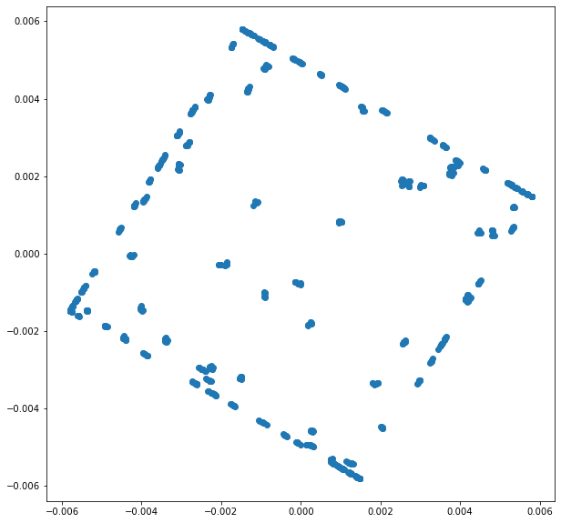
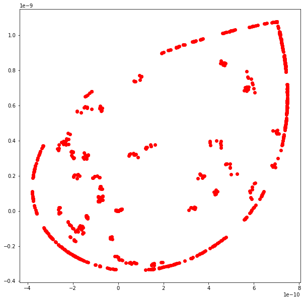
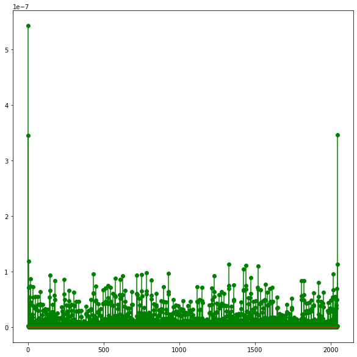
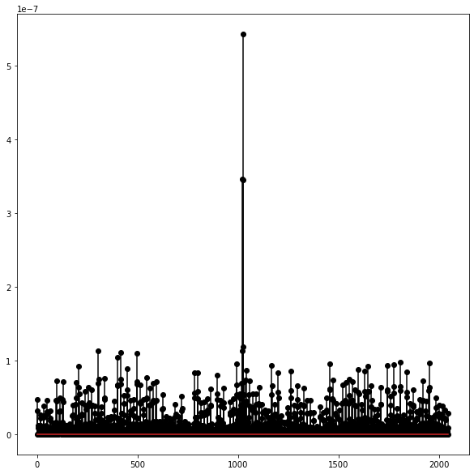
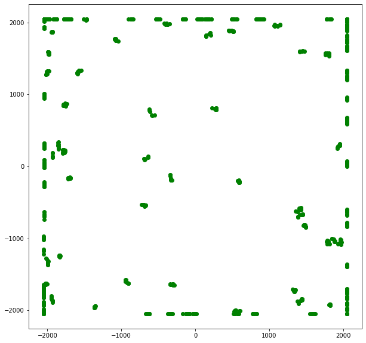

##  Грубая (первоначальная) коррекция частотного смещения

[send_signal_new_way.py](./send_signal_new_way.py) - Формирование и отправка сигнала

    Исходный сигнал 

    Полученный сигнал

    Возведение полученных данных в 4 степень

    Спектр сигнала

    Сдвиг вправо

    Развернутый полученный сигнал (коррекция частотного смещения)

### [file.py](./file.py) - первоначальный способ формирования сигнала и применение коррекции частотного смещения
    Данный способ требует доработки

    Исходный сигнал 

    Полученный сигнал

    Возведение полученных данных в 4 степень

    Спектр сигнала

    Сдвиг вправо

    Развернутый полученный сигнал (коррекция частотного смещения)

