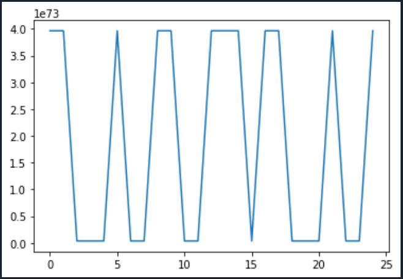

## Квадратурная IQ модуляция. Общая схема формирования и приема сигналов с дискретной модуляцией. Дискретная АМ, формирование символов в формирующем фильтре, прием сигналов. 

### [file_write_signal.py](file_write_signal.py)
    Формирование сигнала для передачи( включая заголовок пакета)
    Запись принятого сигнала в файл для дальнейшей обработки

### [file_read_signal.py](file_read_signal.py)
    Обработка сигнала из файла

## Корреляция полученного сигнала

