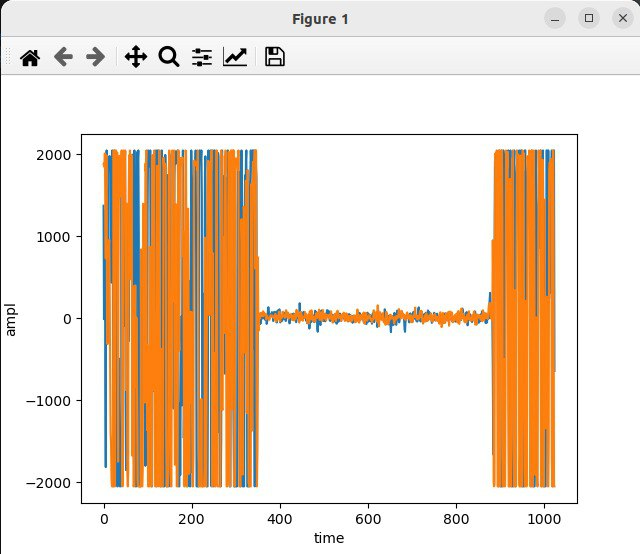
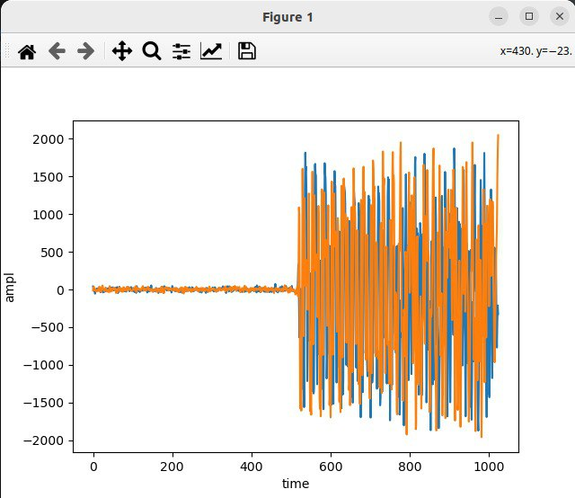

# Изучение основных параметров библиотеки PyAdi для Adalm Pluto SDR

    Определение наисильнейшего сигнала - 2412 Мгц
    Передача данных на данной частоте

    Практика
    Практическое занятие по разделу Дискретизация сигналов

        Значение аналоговой частоты сигнала при частоте дискретизации = 1000 отсчетов/c, которая соответствует нормированной частоте Ω=0.4π рад равна 200 Гц

        Временные диаграммы 

        Частота дискретизации 500 отсчетов/с
        Количество отсчетов сигнала порядка 200 в команде arrange

        fft

