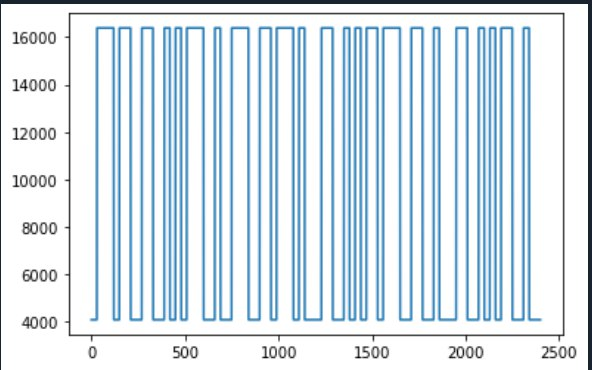

# Амплитудная модуляция. Передача\прием прямоугольного сигнала.

    file1.py - программа способная работать как передатчик так и отправитель сигнала
    Сформированный сигнал

    Полученный сигнал

    

 

