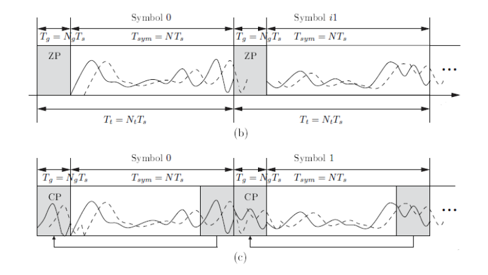

# Формирование и прием OFDM при помощи ДПФ. Защитный интервал. 

1. Формирование и прием OFDM 

- Формирование ofdm-символов 

```py
def gen_ofdm_symbols(qpsk1,num_carrier,cp):

    ofdm_symbols = np.zeros(0)
    qpsk = fill_zeros(qpsk1,num_carrier)
    print("qpsk",len(qpsk))
    for i in range(len(qpsk)//num_carrier):
        ofdm_symbol = np.fft.ifft(qpsk[i * num_carrier : (i+1) * num_carrier], num_carrier) # обратное преобразование фурье
        ofdm_symbols = np.concatenate([ofdm_symbols, ofdm_symbol[-cp:], ofdm_symbol])  # добавление циклического префикса
        
    return ofdm_symbols
```

- Защитный интервал. 


