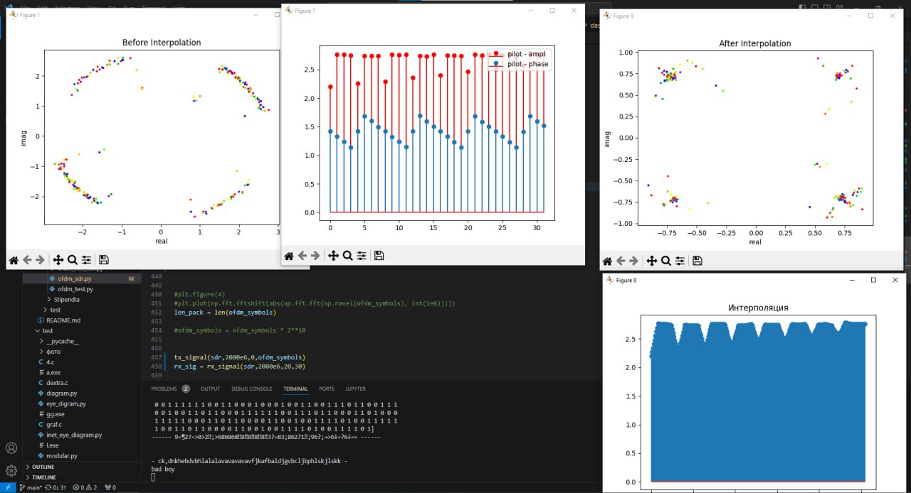
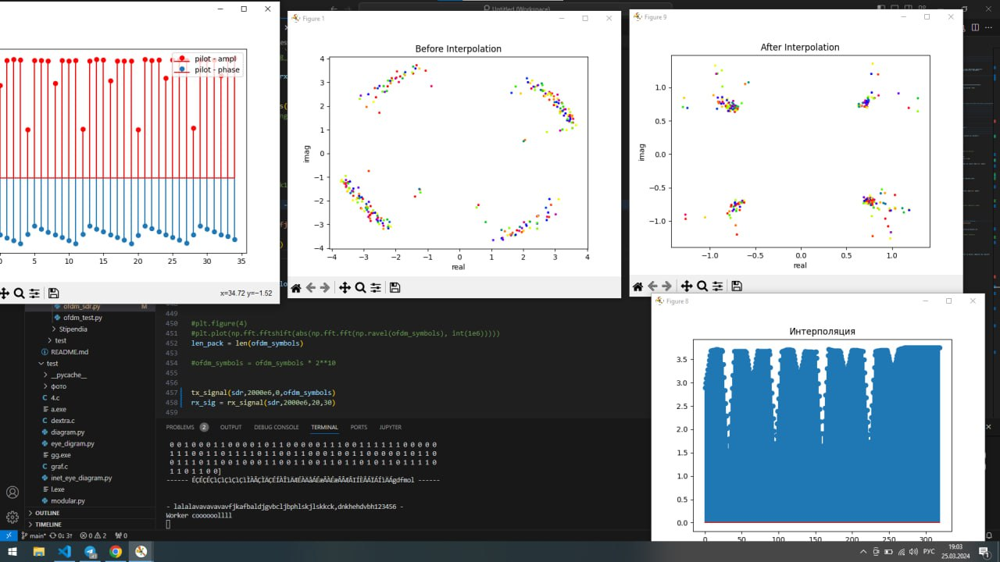
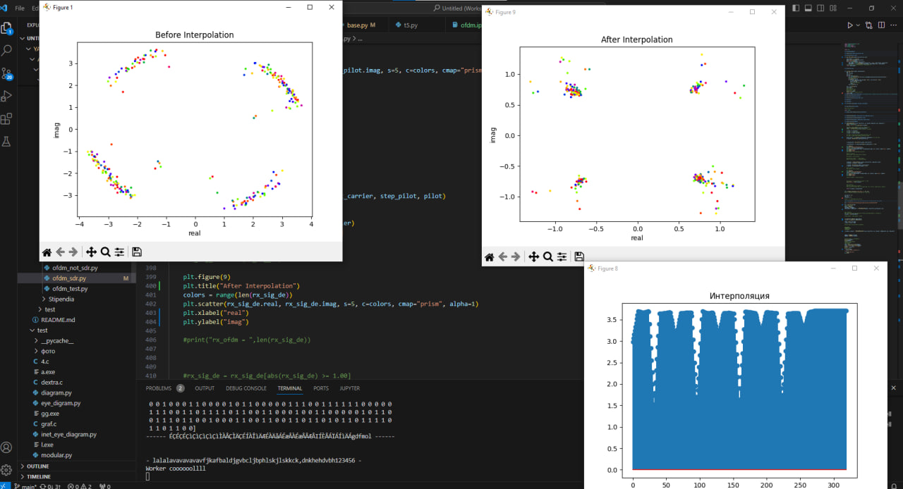

# Прием OFDM. Оценивание канала и коррекция принимаемых символов на поднесущих

- для оценки канала требуется взять поднесущие с пилотами и проинтерполировать их на кол-во поднесущих

```py
def interpolatin_pilot(pilot_carrier, rx_sync,GB_len):
    rx = np.asarray(rx_sync)
    
    
    for i in range(len(pilot_carrier)):
        if pilot_carrier[i] >  128//2:
            pilot_carrier[i] -= 1
    pilot_carrier = pilot_carrier-(GB_len//2  ) 
    print("pppp",pilot_carrier)    

    rx_pilot = np.array([np.take(row, pilot_carrier) for row in rx])
    print("pilot int1",pilot_carrier)
    count_ofdm = len(rx_sync)
    num_carrier = len(rx_sync[0])
    
    pilot = complex(1,1) 
    Hls = rx_pilot / pilot                                                    # частотная характеристика канала на пилотах

    Hls1 = Hls.flatten()

    if 0:                                                                    
        plt.figure(7)
        plt.title("Частотная характеристика канала на пилотах")
        plt.stem(abs(Hls1), "r",label='pilot - ampl')
        plt.stem(np.angle(Hls1),label='pilot - phase')
        plt.legend(loc='upper right')


    all_inter = np.zeros(0)

    ### Интерполяция ###
    for i in  range(count_ofdm):                                                 # цикл по количеству ofdm символов
        x_interp = np.linspace(pilot_carrier[0], pilot_carrier[-1], num_carrier) #np.linspace(0, num_carrier, num_carrier)
        interpol = np.interp(x_interp, pilot_carrier, Hls[i])
        all_inter = np.concatenate([all_inter, interpol])

    if 1:
        plt.figure(8)
        plt.title('Интерполяция')
        plt.stem(abs(all_inter))
        plt.show()
    return all_inter
```


- результат работы для одной SDR. Прием. Оценка канала. Эквалайзер. Декодирование сообщения.






