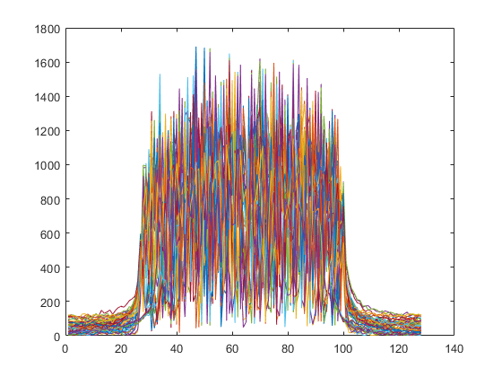
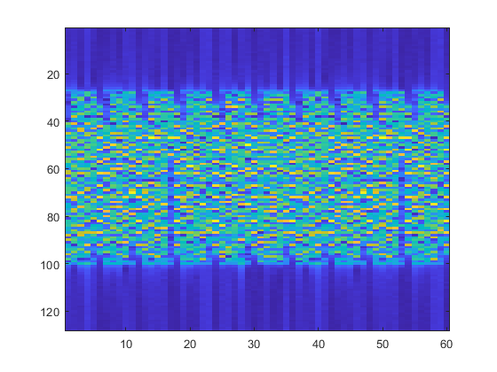
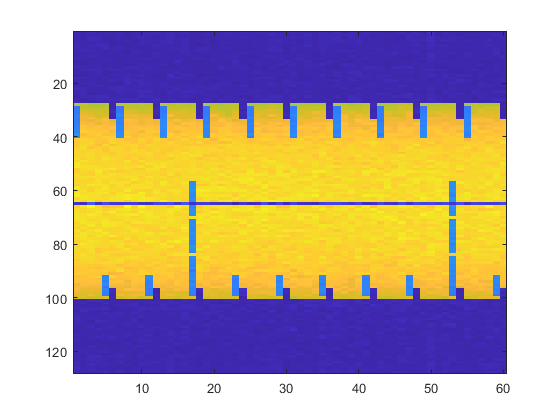

# Прием OFDM. Частотная синхронизация. Ресурсная сетка. Matlab

1. Сигнал без частотной синхронизации.

- Спектр OFDM

- Ресурсная сетка без частотной синхронизации.

2. Сигнал с частотной синхронизацией.

- Спектр OFDM

- Ресурсная сетка без частотной синхронизации.

