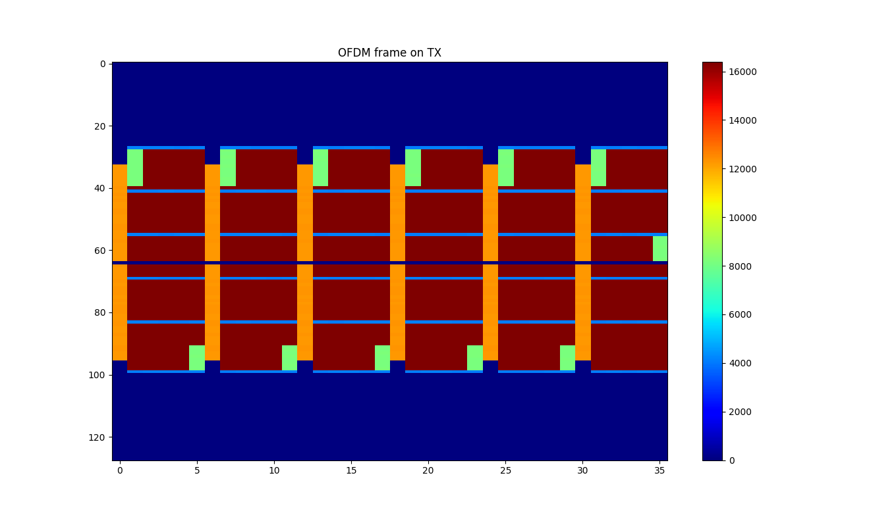
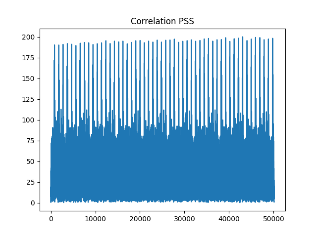
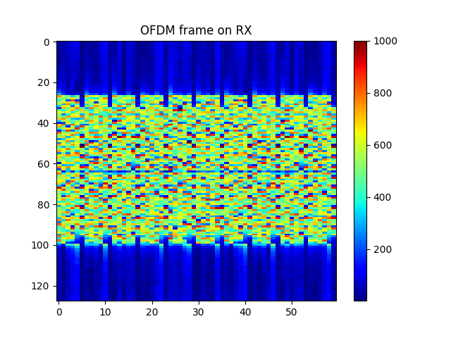
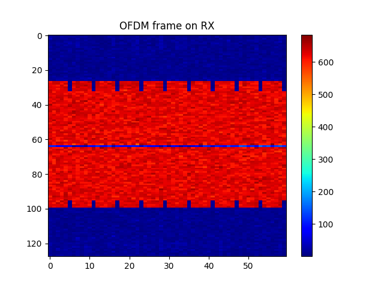
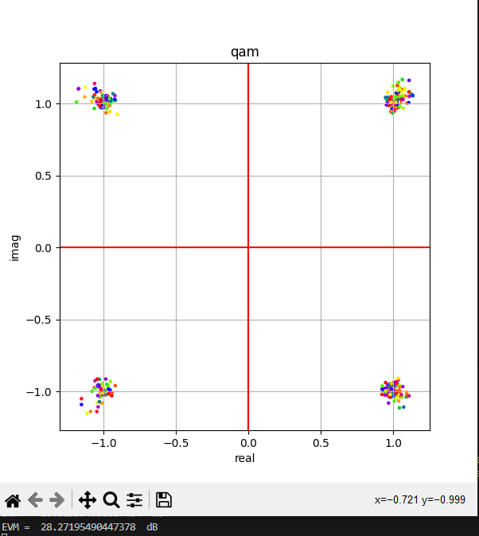
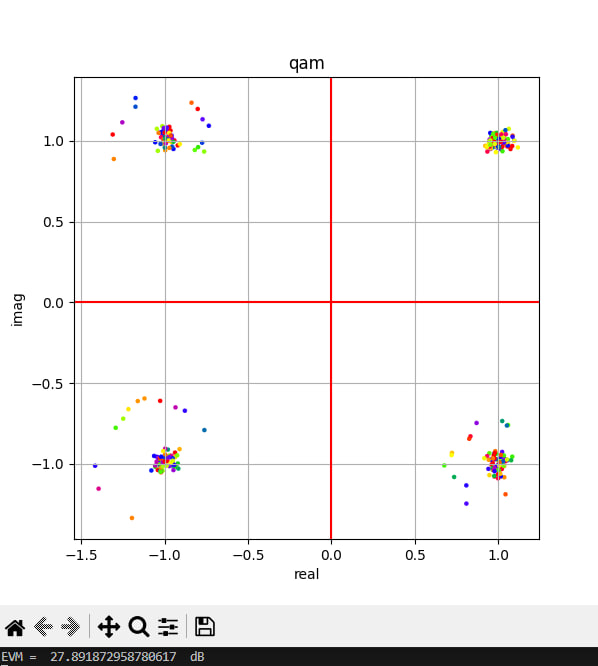
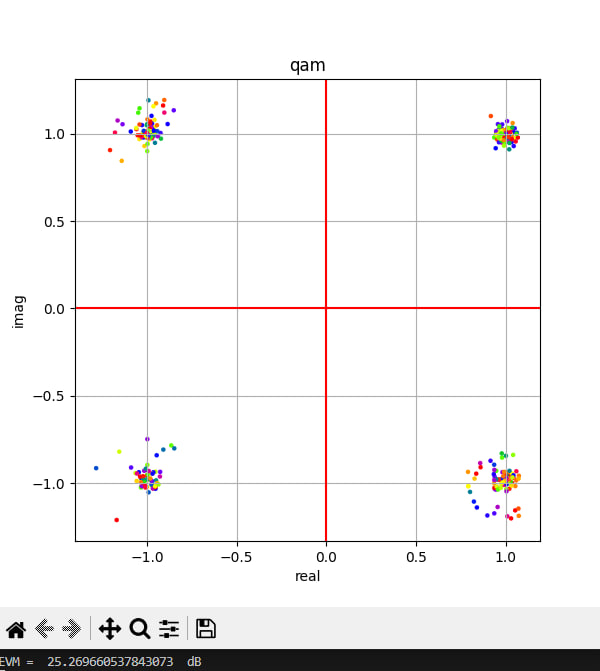
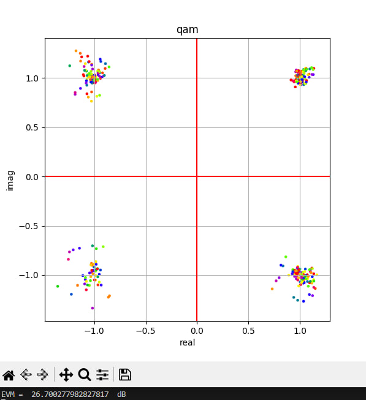
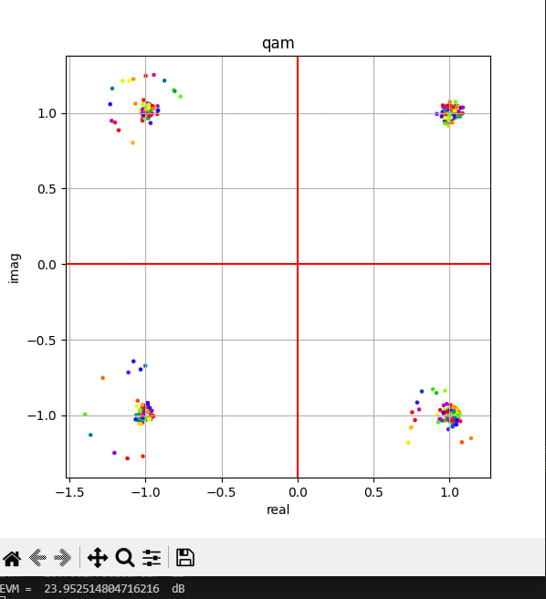

# Прием OFDM. Передача файла по слотам. (полный код в https://github.com/Ivan-PIA/OFDM_TX_RX)

1. Переведем файл tx_file.py в биты

2. Формируем офдм символы по слотам:

- один слот: 6 ofdm-символов 
- 1-й символ в каждом слоте это PSS
- 2-й символ первые 8 бит это номер слота, следующие 8 бит это сколько всего слотов, 16 бит полезная информация в слоте.
- 6-й слот последние 16 бит CRC.

3. Находим корреляцию по PSS

4. Обрезаем по пику корреляции не зная размер сообщения

5. Реализуем частотную синхронизацию.

6. Декодирование:

- Декодируем первый слот и вычисляем сколько всего слотов в сообщении. 
- Возвращаемся и обрезаем по размеру сообщения. 
- Символьная синхронизация. 
- Удаляем PSS. 
- Декодируем остальные слоты. 
- для каждого слота вичляем EVM

 

7. Приняли файл rx.py. Запустили, убедились в правильности.
