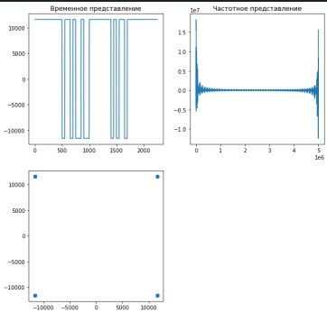
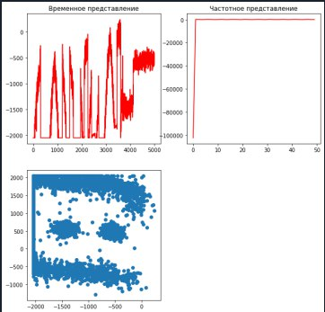
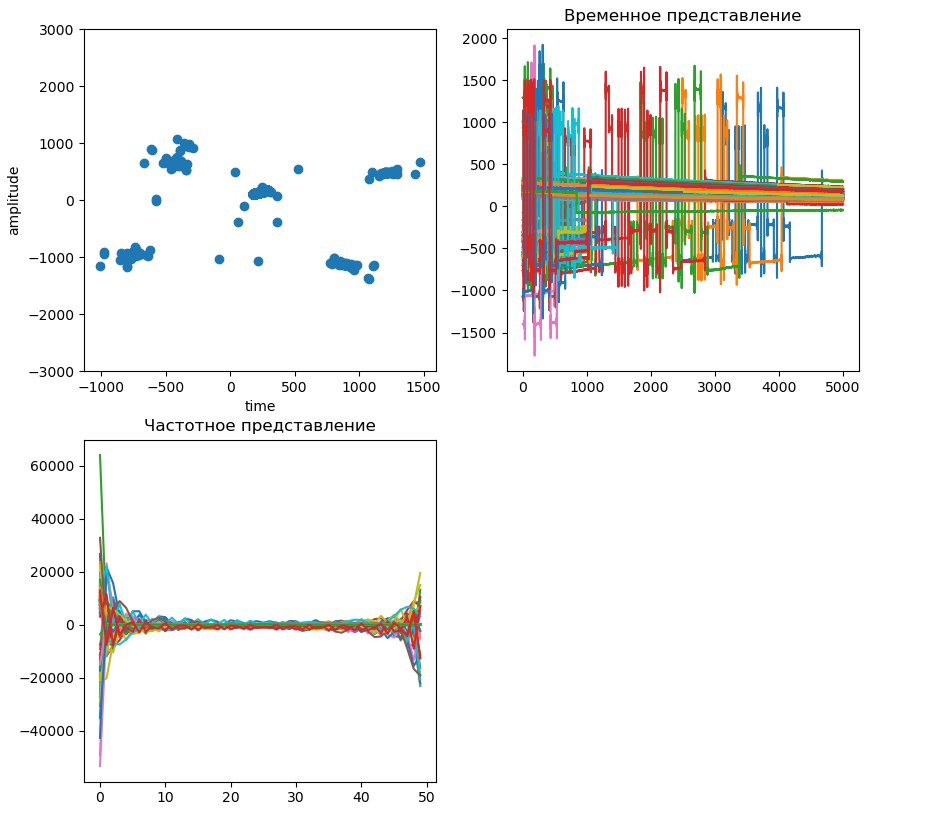
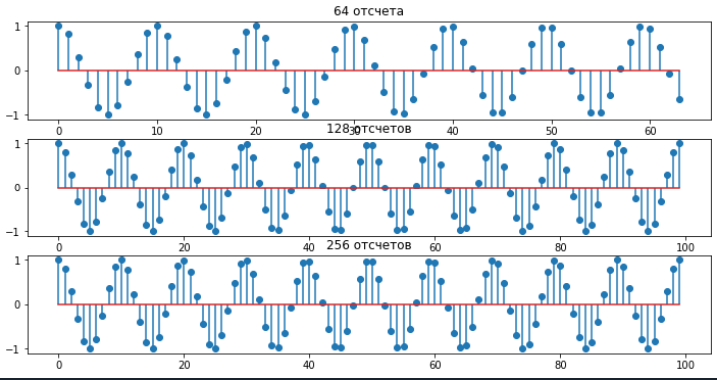
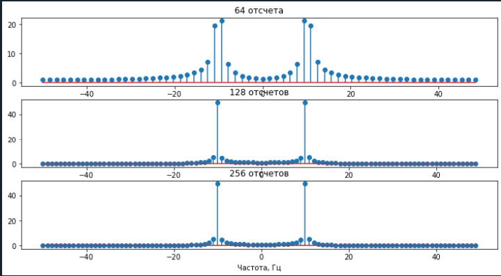
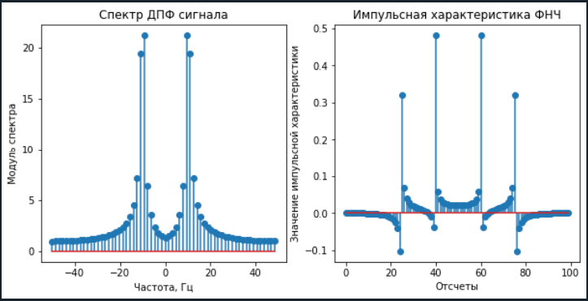
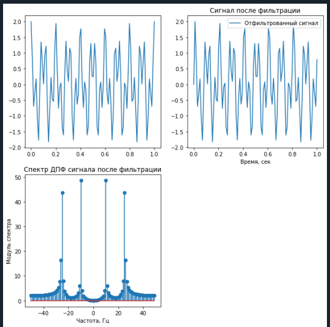

# Задание 1:
    item1.py - программа для генерации передаваемого сигнала и прослушивания сигналов

    Входные параметры:
        N – число бит, четное значение
        Fs – частота дискретизации 
        Ns – число семплов на 1 модуляционный символ (например, 10/30/50/100 семплов на символ)
        Несущая частота – 900 МГц

    Передаваемый  сигнал

  

    Шум
  

    Получаемый сигнал (порядок графиков изменен)
  

    item2.py - Дискретизация сигналов. Вычисление ДПФ 

 

 

 

 

