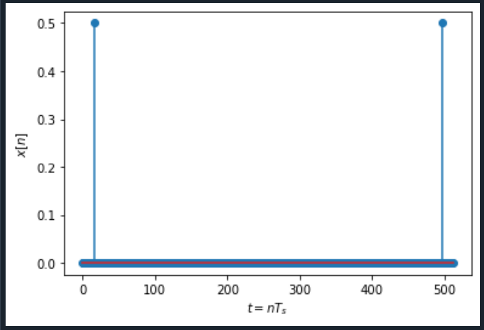
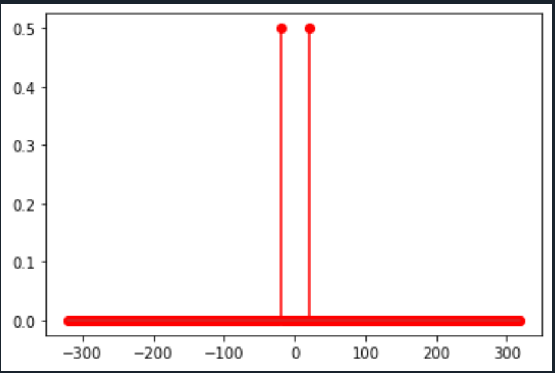
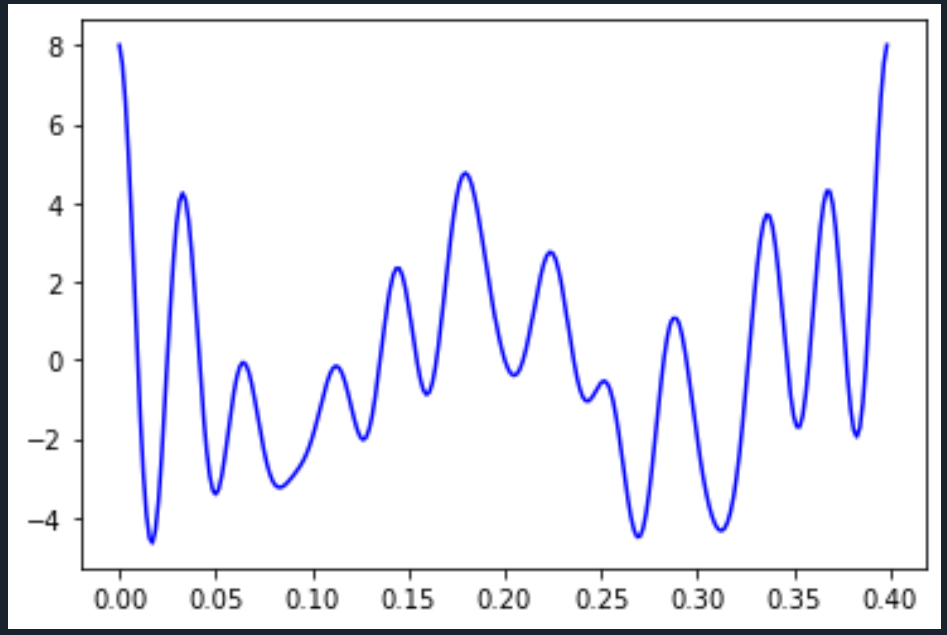

# Изучение основных свойств ДПФ с помощью моделирования в  Python/Spyder

    ds_Fourier.py - дискретное преобразование Фурье

    prtask2.py - Преобразование Фурье к сигналу полученному от Adalm_Pluto_SDR

    1. Для заданных значений частоты сигнала и частоты дискретизации получите дискретное колебание, отсчеты посмотрите в Variable Explorer. Далее увеличьте частоту сигнала в несколько раз, при этом так же увеличится и частота дискретизации, но отношение частоты сигнала и частоты дискретизации - нормированная частота останется той же величиной.
    Сравните дискретные отсчеты первого и второго сигналов.

    2. Вычислите шаг частот между точками ДПФ ∆f =fs/N. Определите, в
    какой точке ДПФ находится заданный сигнал.
    fs = 320, N = 256
    ∆f = fs/N = 1.25 
    fс = 20, частота сигнала
    dpf = fc / ∆f = 16

    3. Измените частоту сигнала в целое чисто раз, определите номер точки
    ДПФ для данного сигнала.

    4. Измените количество точек ДПФ до 512. Вычислите шаг частот между
    точками ДПФ ∆f = fs/N. Определите, в какой точке ДПФ находится заданный сигнал.

    5. Задайте сигнал в виде суммы двух колебаний. Вычислите ДПФ сигнала.

    6.  Вычислите ОДПФ сигнала, заданого в частотной области в виде X=np.array([0,0,1,0,0,0,0,0]).
    Задавайте ненулевое значение в различных разрядах. Также задайте значение в комплексной форме X=np.array([0,0,1j,0,0,0,0,0]), поменяйте знак
    мнимой единицы, задайте спектр ДПФ в виде X=np.array([0,0,2-1j,0,0,0,0,0])
    поменяйте знак мнимой единицы. Можно увеличить количество точек до
    16 при одном ненулевом значении.

    X=np.array([0,0,1,0,0,0,0,0]) - 1 график
    X=np.array([0,0,1,0,0,0,1,1]) - 2 график

    X=np.array([0,0,1j,0,0,0,0,0]) - 1 график
    X=np.array([0,0,-1j,0,0,0,0,0]) - 2 график
    

    X=np.array([0,0,2+1j,0,0,0,0,0]) - 1 график
    X=np.array([0,0,2-1j,0,0,0,0,0]) - 2 график

    X=np.array([0,0,2+1j,0,0,0,0,1,1j,0,0,2,1,1,1,0])

