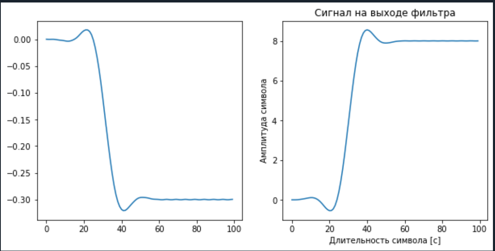
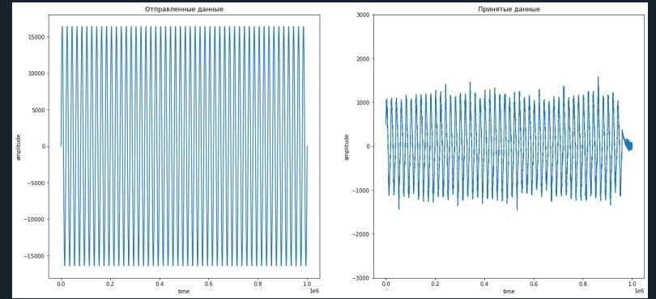
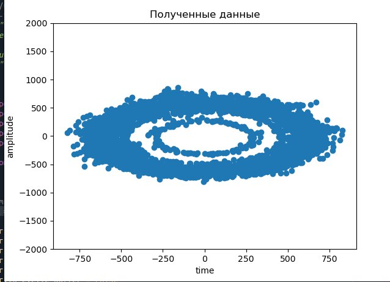

# Модуляции QPSK, QAM. Раздельный приём и передача на SDR

    file1.py - Программа взятая за основу (Моделирование сигнала, накладывание шума, декодирование)
    

Графики file1.py

    file2.py - Отправленный и полученный сигнал соответственно

    file3.py - спектр полученного сигнала

    file4_e3.py - другой вид представления полученного сигнала

